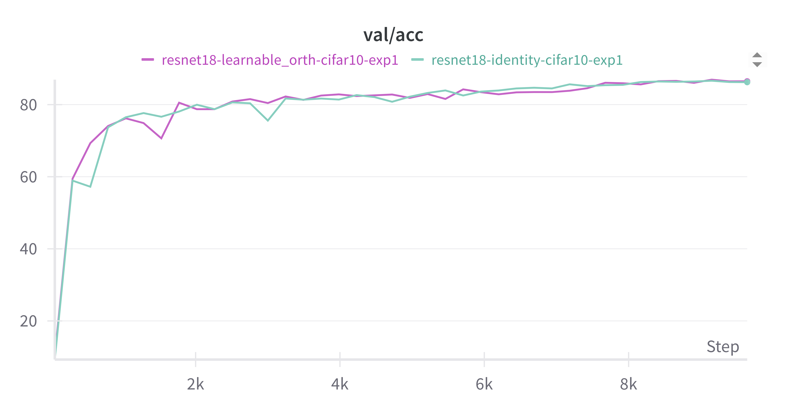

# Orthogonal skip connections

> TLDR; inspired by ResNets, which look like $(f_1 + I) \circ (f_2 + I) \circ \ldots \circ (f_L + I) (x)$, we study $(f_1 + W_1) \circ (f_2 + W_2) \circ \ldots \circ (f_L + W_L) (x)$, where $W_i$ are orthogonal matrices. I found that they only look good on paper, unfortunately.

Residual connections proposed in the ResNet paper [cite] were a breakthrough since they enabled training of very deep networks. Very deep networks are nice because they can learn more complex mappings. For example, humanoid RL agents trained with 1000 layer networks suddenly learned jumping over walls when faced with navigating a labirynth. 

Let's assume we want to learn some complex function $f : \mathbb{R}^d \to \mathbb{R}^d$. What ResNet did, is instead of learning a composition of some simple non-linear functions $f_1 \circ f_2 \circ \ldots \circ f_L$, they learn a more stable composition of near-identity functions $(f_1 + I) \circ (f_2 + I) \circ \ldots \circ (f_L + I) (x)$, where $I$ is the identity matrix $I(x) = x$. 

The intuition is that if $f_i$ are small, then $f_i + I$ is close to the identity function, which is easy to optimize. The network can learn to make $f_i$ small, and then fine-tune them to get the desired function.

It is therefore desirable to have $\| I(x) \| = \| x \|$. But this is the exact defining property of orthogonal (or more generally, unitary) matrices. I think that **with orthogonal matrices we could have even deeper networks**. I think this is because a skip connection $W_i$ would now have more representational power, so it could absorb some more complexity from the function $f_i$. 

To support this claim, I proved this theorem, which is adopted from [cite].

## Theory

**Theorem**. Let $f(x) : \mathbb{R}^d \to \mathbb{R}^d$ be some *sufficiently nice* function (more details [here](https://github.com/gournge/orthogonal-skip-connections)). Let $W_i, i \in \mathbb{N}$ be *any* $d \times d$ orthogonal matrices. Then there exist functions $f_i$ so that the following holds:
$$
    f(x) = (f_1 \circ f_2 \circ \ldots \circ f_L) (x)
$$
and the following terms decrease in $O\left(\frac{\log m}{m}\right)$ rate:  $\|f_i-W_i\|_L, \ \| I - W_i\|$ for $i=1,\ldots,L$.

So in plain words: **we can approximate functions with near-orthogonal matrices**.

The proof is a lot of algebra, but the main idea is using the identity $\| W(x) \| = \| x \|$. I introduced the constraint of $\| I - W_i\|$ decreasing, because I couldn't prove it in full generality.

## Practice

Training on CIFAR-10 with ResNet-18 architecture, I found that orthogonal skip connections perform almost the same as identity skip connections. 

## Related work

**Orthogonal skip connections**. There is was also one paper I found which proposed to use orthogonal skip connections: [cite]. They had similiar justifications, but they didn't provide any theoretical guarantees. They also didn't show substantial empirical improvements.

**Orthogonal projections in skip connections**. [cite] proposed the idea of using $P_W(f) + I$ in each block, where $P_W$ is an orthogonal projection onto the residual stream. It showed ~2% improvement in some image benchmarks.

**Manifold-Constrained Hyper-Connections**. [cite] 

## Some notes

- In high dimensions random matrices are close to orthogonal, since 2 random vectors are close to orthogonal. We could somehow use that fact to train networks more efficiently, or obtain some exponential identities, like in case of Johnson-Lindenstrauss lemma.

